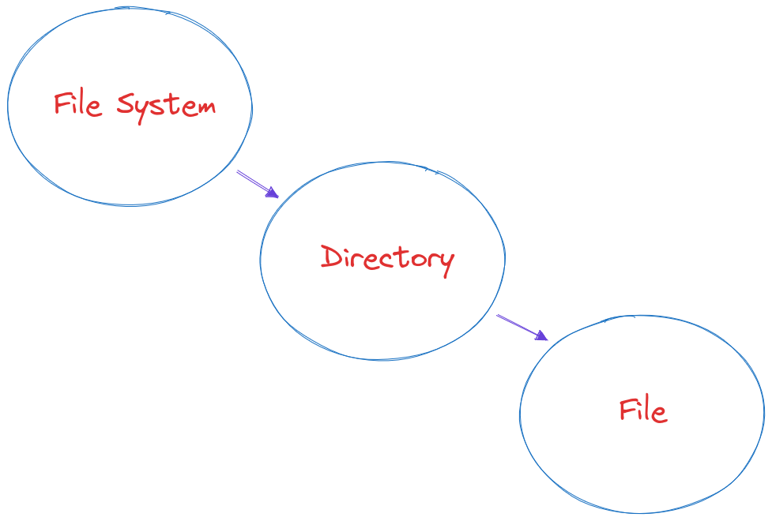

# Composite Pattern

Object inside an object.

Break a problem into Tree like structure.

Create the tree like structure with Interfaces.

# Example

# Use cases

1. Design File System
2. Design Calculator

