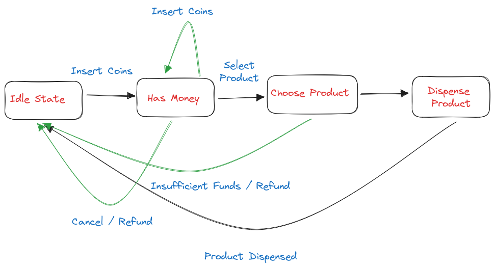

# State Pattern

State is a behavioral design pattern that lets an object alter its behavior when its internal state changes. 

It appears as if the object changed its class.

# Use cases

Anywhere where we can model states.

1. Design Vending Machine

2. Design TV

3. Design ATM

# Example

We first need to draw the state diagram for any given task.

Once we have the state diagram and clear requirements we can proceed to designing the classes.

