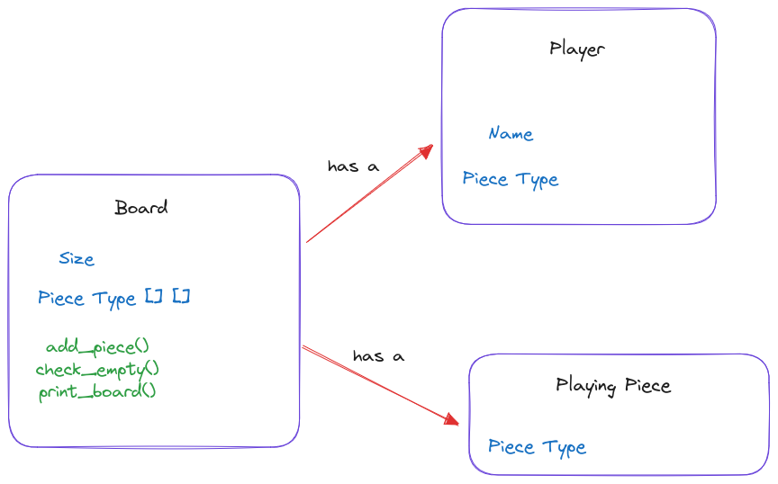

# Design A Tic Tac Toe Game

Simple what we played in school.

Player has choice to choose X, O

2 Players but can extend.

Winner when 3 in row. Generalize to N.

# Understanding and UML

# High Level Implementation

